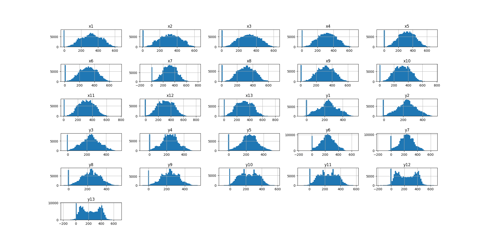
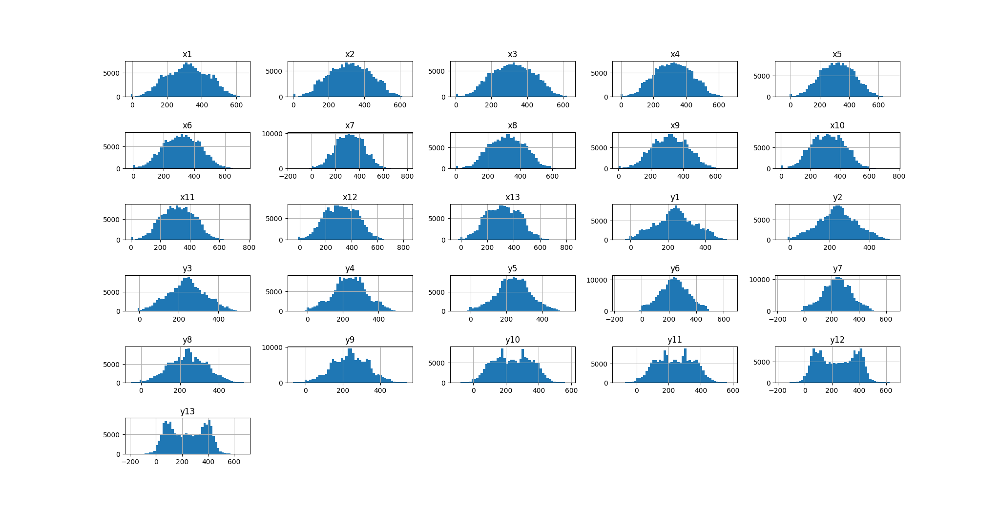
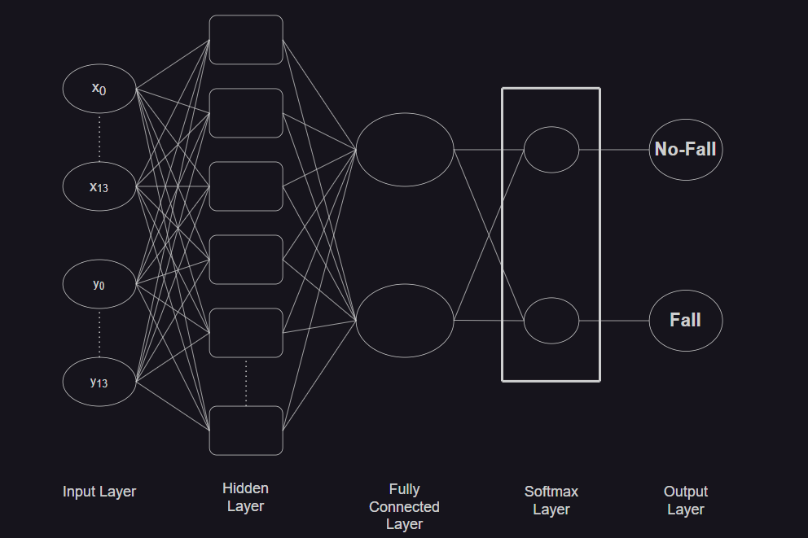
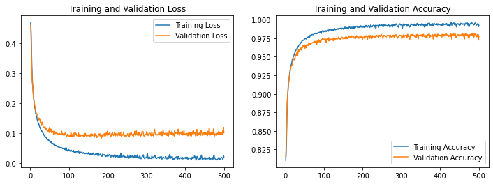
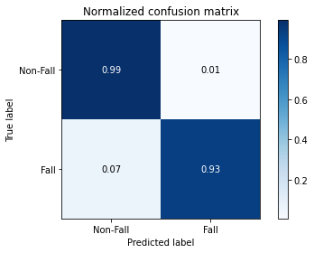

# 模型訓練
1. 將數據集的影片分割為連續圖像序列。
2. 將圖片序列使用 `Mediapipe` 取出骨架，將得到 33 個人體關節點 (x, y)。
3. 數據的預處理，如：最小最大值正規化、相對位置正規化、線性插值 + 相對位置正規化。
4. 將數據集分為測試集和訓練集，輸入到模型中訓練，完成模型訓練後，就能進行分類的測試。

## 數據集分類
將數據集分為非跌倒事件及跌倒事件，並且每 100 筆資料分為一組，做時間序列。

| 數據集 | 非跌倒事件 (組) | 跌倒事件 (組) |
| -------- | -------- | -------- |
| UR Fall Detection Dataset | 320 | 320 |
| Fall Detection Dataset | 480 | 480 |
| Mix Dataset | 800 | 800 |

## 骨架取得
使用 `UR Fall Detection Dataset` 以及 `Fall Detection Dataset` 兩個數據集進行訓練。

### 1. 將兩個數據集的影像尺寸統一調整為 640 * 480。
[相關程式碼](tools/images_resize.py)

### 2. 透過 `Mediapipe` 取得骨架。
使用 `Mediapipe` 的 `Pose` 模型可以標記出身體 33 個關節點的位置。

保留了 13 個重要點位當作訓練的特徵值，其中保留了鼻子、肩膀、手肘、手腕、臀圍、膝蓋及腳踝的關節點。 

[相關程式碼](tools/pose_get.py)

## 數據預處理
### 1. 資料增強
確保訓練時不會產生過度擬合，將圖像進行旋轉，創造出更多的圖像來讓機器學習，彌補資料量的不足。

[相關程式碼](tools/data_augmentation.py)

### 2. 位移人體骨架
將人體骨架將移動到圖像中央，去除了原始數據中，人體位移過程這個特徵，像是左走到右或是從遠方走到近，將人體骨架固定在相同位置，做出連續動作讓模型更容易學習。

**1. 取得基準點：**

$X^{}_{BM} = \frac{X^{}_{Lhip} + X^{}_{Rhip}}{2}$

及

$Y^{}_{BM} = \frac{Y^{}_{Lhip} + Y^{}_{Rhip}}{2}$

**2. 取得中心點：**

$X^{}_{c} = \frac{W}{2}$

及

$Y^{}_{c} = \frac{H}{2}$

**3. 取得位移距離：**

$X^{}_{dis} = X^{}_{BM} - X^{}_{c}$

及

$Y^{}_{dis} = Y^{}_{BM} - Y^{}_{c}$

**4. 正規化座標點：**

$X^{}_{r} = X^{}_{n} - X^{}_{dis}$

及

$Y^{}_{r} = Y^{}_{n} - Y^{}_{dis}$

### 3. 線性插值
**線性插值前的分佈圖**

**線性插值後的分佈圖**

[相關程式碼](tools/linear_interpolation.py)

## 模型訓練
[訓練過程](lstm_model.ipynb)

### 設備資訊
| GPU | CPU |
| :----: | :----: |
| NVIDIA A100 | 	Intel Xeon |

### 模型結構

### 訓練參數
| 名稱 | 參數 |
| -------- | -------- |
| 混合數據集數量 | 1600 |
| 訓練數據集數量 | 80% (1280 組) |
| 測試數據集數量 | 20% (320 組) |
| 數據集處理 | 相對位置正規化 + 線性插值 |
| 學習率 | 0.001 |
| 批次大小 | 1280 (根據數據集數量決定) |
| Epochs | 500 |
| 輸入神經元數量 | 26 |
| 隱藏神經元數量 | 512 |
| 輸出神經元數量 | 2 |
| 激勵函數 | Tanh |
| 最佳化算法 | Adam |
| 損失函數 | Cross Entropy |

## 模型測試
### 訓練結果

### 評估 LSTM 模型
| Test Loss | Test Accuracy |
| :----: | :----: |
| 0.10224159806966782 | 0.9780625104904175 |

### 預測結果
| Correct predictions | Incorrect predictions |
| :----: | :----: |
| 31298 | 702 |

### 混淆矩陣

## 測試模型

# 參考資料
* [Lin, Chuan-Bi, et al. "A framework for fall detection based on OpenPose skeleton and LSTM/GRU models." Applied Sciences 11.1 (2020): 329.](http://ir.lib.cyut.edu.tw:8080/bitstream/310901800/38339/1/108CYUT0652018-003.pdf)

* [MediaPipe Pose](https://google.github.io/mediapipe/solutions/pose.html)

* [遞歸神經網路（RNN）和長短期記憶模型（LSTM）的運作原理](https://brohrer.mcknote.com/zh-Hant/how_machine_learning_works/how_rnns_lstm_work.html)